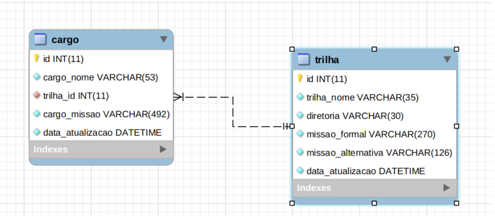

# API Cargos e Trilhas

Backend desenvolvido como teste usando a metodologia TDD. Abaixo é mostrado o relacionamento das entidades.



Tecnologias usadas:
 * Java 11
 * MySQL
 * Springboot
 * Docker
 * Swagger


## Instalação

Para usar o projeto é necessário gerar o arquivo .jar da aplicação. Para isso, execute os comandos abaixo:

```bash
mvn clean package -DskipTests
```
Após a geração do arquivo, execute o comando
```bash
docker-compose up -d
```

O container do banco MySQL demora alguns minutos para estar disponível, portanto, a aplicação java irá reiniciar algumas vezes até obter uma conexão. É possível monitorar o andamento do processo com o comando
```bash
docker-compose logs
```

Após a inicialização completa da aplicação, use o comando abaixo para restaurar a base de dados disponibilizada.
```bash
docker exec -i trilhas-cargos-api_mysql-instance_1 mysql -uroot -proot b2w < bkp.sql
```

* O arquivo bkp.sql é o nome do arquivo de restauração disponibilizado. 
* trilhas-cargos-api_mysql-instance_1 é o nome do container do MySQL. Pode ser verificado executando ```docker ps``` no terminal. Caso o nome seja diferente, b2w_mysql-instance_1 pelo nome da sua instância.

## Uso

Após inicializada e com o banco restaurado, a aplicação possui um Swagger rodando em

```bash
http://localhost:8080/swagger-ui/
```
É possível testar as funcionalidades das APIs através da interface gráfica ou usando chamadas via Postman.

## Melhorias

Algumas melhorias a serem feitas:

* Configuração do TravisCI para integração contínua
* Deploy automático (CD) no Heroku
* Métricas de desempenho com Springboot Admin Dashboard
* Fazer testes de integração do BD
* Aumentar o número de testes unitários


## License
[MIT](https://choosealicense.com/licenses/mit/)